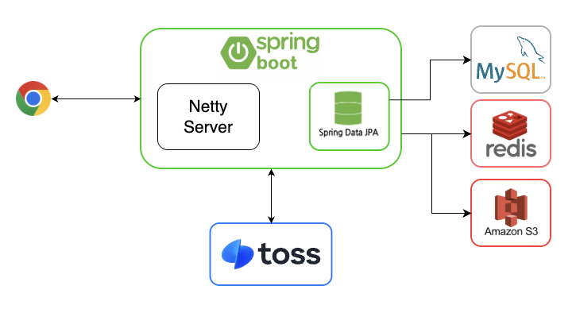
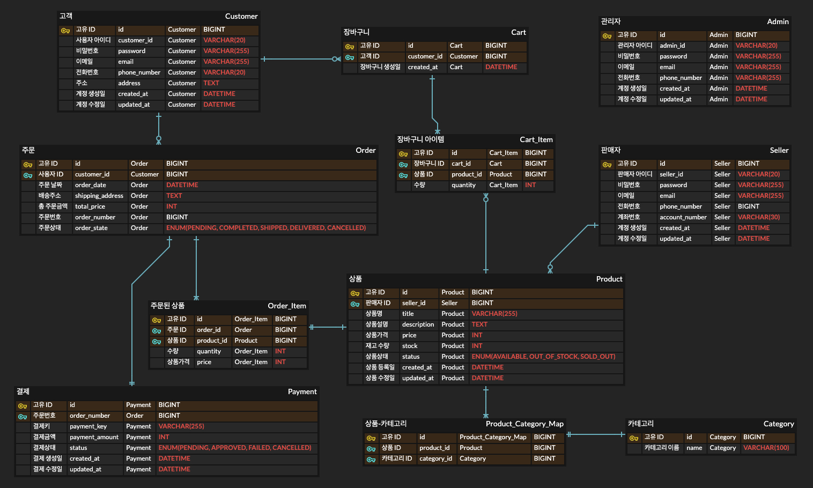
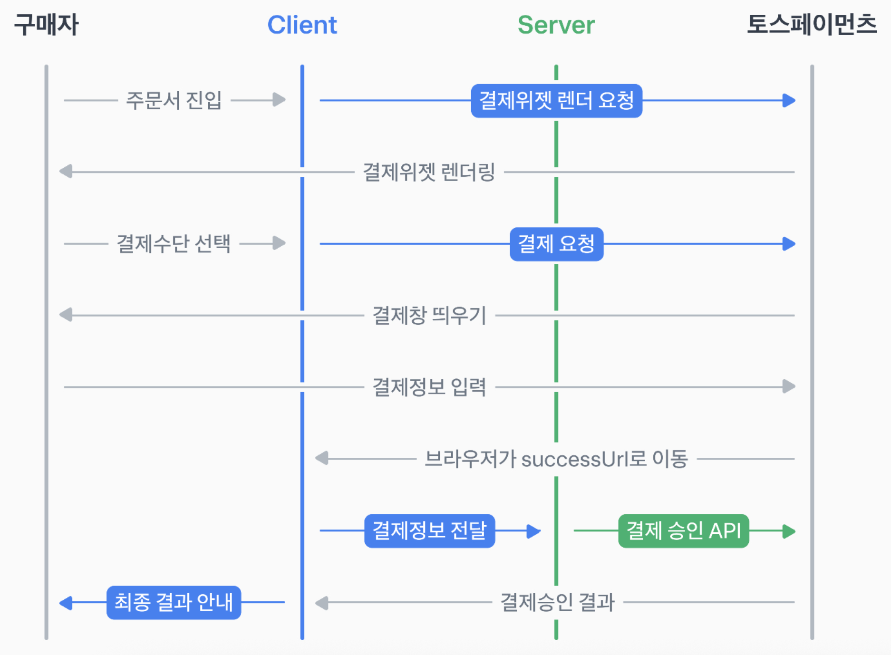

# 이커머스 프로젝트

## ✅ 프로젝트 설명
사용자들이 상품을 등록하고 판매할 수 있도록, 그리고 또다른 사용자들이 상품을 구매할 수 있도록 서비스를 제공하는 온라인 쇼핑몰 플랫폼을 구현한다. 각 기능들을 RESTful-API 로 제공한다. 주문이 들어올 때 실제 토스페이, 카카오페이와 같은 OPEN-API 결제 시스템을 사용해서 결제가 진행될 수 있도록 제공한다.

## ✅ 아키텍처

- 웹서버 백엔드 개발을 빠르고 편리하게 도와주며, 유지보수, 기술 등의 이점을 주는 자바의 대표적인 웹 프레임워크인 Spring을 활용한다.
- 토스뱅크의 서버와 직접적으로 통신하여 결제처리를 수행한다.
- 결제 처리 과정에서, 웹플럭스를 활용한 논블로킹/비동기 처리를 위해 내장 서버를 톰캣이 아닌 네티 서버로 구동시킨다.
- 주문 생성 시, 동시성 처리를 고려하여 레디스를 이용하여 동시성 문제를 해결한다.
- 상품에 대한 이미지와 같은 파일들을 적절하게 저장하고, 반환할 수 있도록 하기 위해 파일 저장과 관련된 api 를 제공하는 Amazon S3 를 사용한다.
- 상품, 주문, 사용자 등의 다양한 서비스들에 대한 관계적인 데이터 관리를 위해 관계형데이터베이스인 MySQL 을 사용한다.

## ✅ ERD

### [ERD 설계 링크](https://www.erdcloud.com/d/J9rwTMoJ3f2hoBn3W)

## ✅ 프로젝트 기능 상세

### 1️⃣ 사용자
- 회원가입
  - 사용자 유형(고객, 판매자, 관리자)에 대한 회원가입 처리
  - 고객, 판매자, 관리자에 대한 엔티티를 구분함
- 로그인
  - 사용자 유형에 따른 로그인을 구분함
- 로그아웃
  - 로그인 기능과 동일

### 2️⃣ 상품
- 상품 등록 [판매자만]
  - 상품명, 설명, 가격, 재고, 상품상태 등의 정보를 클라이언트로부터 받아서 상품등록을 처리하는 기능
  - 이미지 AWS S3 로 저장. 최대 10개 저장. AWS S3로 이미지 저장 후, URL을 DB에 저장하여서 요청시 URL을 사용하도록 함
- 상품 수정 [판매자만]
  - 상품 등록 기능과 동일한 데이터들에 대한 수정을 할 수 있도록 하는 기능
- 상품 삭제 [판매자만]
  - 등록된 상품에 대한 권한을 가진 사람만 상품 삭제를 할 수 있도록 기능
- 상품 조회 [고객, 판매자 둘다 사용가능]
  - 최신순(상품 등록일 순), 이름순으로 정렬
  - 카테고리에 의한 필터링 조회
  - 페이징을 활용해 한번에 최대 20개의 상품 데이터 조회

### 3️⃣ 장바구니 [고객만]
- 장바구니 담기
  - 여러개의 삼풍을 담을 수 있음
- 장바구니 상품 삭제
  - 하나의 상품을 장바구니에서 제외시키는 기능
- 장바구니 조회
- 장바구니 비우기
  - 장바구니의 전체 상품을 제외시키는 기능

### 4️⃣ 주문
- 주문 생성 [고객만]
  - 장바구니에 담겨진 상품에 대한 주문 진행
  - 주문시 결제 진행
  - 주문시 주문상태 변경(주문완료)
  - 재고에 대한 동시성 이슈
- 주문 취소 [고객만]
  - 주문취소 요청시 결제취소 진행
- 주문 상태 변경[관리자만]
  - 주문완료된 데이터에 대해서만 배송중, 배송완료 등으로 변경할 수 있음
- 주문 조회 [고객, 판매자]
  - 주문완료, 배송중, 배송완료, 주문취소 정보 제공
  - 상품명, 가격, 주문 및 주문취소 날짜 정보 함께 제공
- 주문 알림
  - 주문 상태, 결제상태가 변경이 될 때, 고객에게 알려주는 서비스

### 5️⃣ 결제
- 결제
  - 토스페이먼츠 OPEN-API를 사용해 결제를 함께 처리
  - 카드 결제만 구현
  - 단건  결제만 구현
  - 결제 프로세스 흐름

  - 참고 URL
    - [토스페이먼츠_개발자센터_PG와 온라인 결제 URL](https://docs.tosspayments.com/guides/v2/get-started/online-payment)
    - [토스페이먼츠_개발자센터_결제 흐름 이해하기 URL](https://docs.tosspayments.com/guides/v2/get-started/payment-flow)
    - [토스페이먼츠_개발자센터_결제 연동하기 URL](https://docs.tosspayments.com/guides/payment-widget/integration)
    - [토스페이먼츠_개발자센터_결제 객체 URL](https://docs.tosspayments.com/reference#%EA%B2%B0%EC%A0%9C)
    - [토스페이먼츠_개발자센터_결제 에러코드 URL](https://docs.tosspayments.com/reference/error-codes#%EA%B2%B0%EC%A0%9C-%EC%A1%B0%ED%9A%8C)
  1. 결제 준비 요청(클라이언트 → 서버)
     1. 클라이언트로부터 주문을 요청받음
     2. 서버에서 주문번호 생성함
     3. 해당 주문 정보를 서버에서 임시 저장(주문번호, 금액, 고객 아이디, 결제상태 등..)
  2. 주문번호 반환(서버 → 클라이언트)
     1. 서버에서 생성한 주문번호를 클라이언트에게 응답함
     2. 클라이언트에서 PG사로 결제 요청을 보낼 때, 서버로부터 받은 주문번호를 전달헤야 함
  3. 결제 요청, 구매자 정보 인증(클라이언트 → PG사)
     1. 결제요청 메서드의 파라미터로 주문번호, 성공,실패 리다이렉트 url 을 전달
     2. 성공, 실패에 대한 url은 결제요청을 PG사가 결제 인증을 마친 후, 다시 클라이언트 브라우저를 리다이렉트시킬 url을 의미
  4. 결제 성공시 리다이렉트(PG사 → 클라이언트)
     1. 성공 URL로 이동하며 쿼리 파라미터(paymentKey, orderId, amount)를 받음
  5. 결제 승인 요청(클라이언트 → 서버)
     1. 성공 URL에서 쿼리 파라미터(paymentKey, orderId, amount)를 클라이언트에서 서버로 전달함
  6. 결제 승인(서버 → PG사)
     1. 클라이언트로 받은 쿼리 파라미터(paymentKey, orderId, amount)로 결제 승인에 대한 검증을 거침. 이전에 결제 준비 요청에서 저장해두었던 주문정보와 비교하여 결제 승인을 결정함
     2. 정보가 일치하면 PG사에 결제 승인 요청을 전송 → 결제 정보를 DB에 저장
     3. 결제가 승인되면 주문완료(결제완료)로 업데이트
     4. 정보가 일치하지 않으면 클라이언트에 결제 실패를 응답 → 주문 실패 처리

- 결제 취소
  - 결제취소 프로세스 흐름
    1. 사용자의 주문 취소 요청(클라이언트 → 서버)
       - 클라이언트로부터 주문 취소 요정을 받음
    2. 결제 취소 요청(서버 → PG사)
       - 주문 취소 요청에 대해 서버에서는 PG사로 결제 취소 요청을 보냄
    3. 결제 취소 요청에 대한 응답(PG사 → 서버)
       - 결제 취소가 완료되면 주문 상태도 업데이트

- 결제 조회
  - 결제에 대한 데이터 조회

## ✅ 사용기술
- JAVA
- Spring Boot
- Spring Framework
- Spring Security
- Spring Data JPA
- Spring WebFlux
- MySQL / Redis
- Docker / AWS S3
