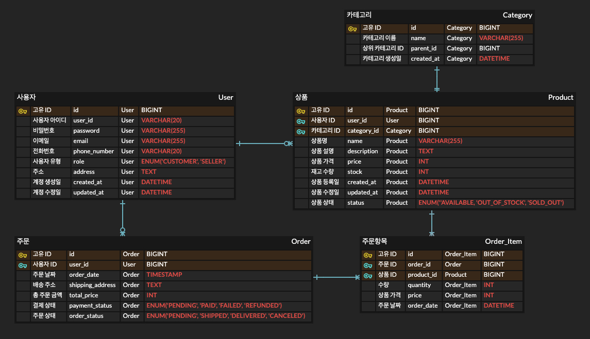

# 이커머스 프로젝트

## ✅ 프로젝트 설명
사용자들이 상품을 등록하고 판매할 수 있도록, 그리고 또다른 사용자들이 상품을 구매할 수 있도록 서비스를 제공하는 온라인 쇼핑몰 플랫폼을 구현한다. 각 기능들을 RESTful-API 로 제공한다. 주문이 들어올 때 실제 토스페이, 카카오페이와 같은 OPEN-API 결제 시스템을 사용해서 결제가 진행될 수 있도록 제공한다.

## ✅ 프로젝트 기능

### 1️⃣ 사용자
- 회원가입
    - 고객, 판매자에 대한 회원가입 처리
- 로그인
- 로그아웃

### 2️⃣ 상품
- 상품 등록
    - 상품명, 설명, 가격, 재고, 상품상태 등의 정보를 클라이언트로부터 받아서 상품등록을 처리하는 기능
- 상품 수정
    - 상품 등록 기능과 동일한 데이터들에 대한 수정을 할 수 있도록 하는 기능
- 상품 삭제
    - 등록된 상품에 대한 권한을 가진 사람만 상품 삭제를 할 수 있도록 기능
- 상품 조회
    - 검색을 통한 상품의 목록을 보여주는 기능

### 3️⃣ 주문
- 주문
    - 토스, 카카오페이 OPEN-API를 사용해 결제를 함께 처리
- 주문 취소
    - 주문 취소 요청시, 결제에 대한 취소 기능도 진행
- 주문 조회
    - 결제 상태가 결제중, 결제됨, 결제실패, 환불 등 어떠한 상태인지 정보를 제공
    - 주문 상태가 주문 완료, 배송중, 배송 완료, 주문 취소 등 어떠한 상태인지 정보를 제공

### 4️⃣ 결제
- 결제
- 결제 취소
- 정산

## ✅ ERD

## ✅ 사용기술
- JAVA 17
- Spring Boot v3.4.5
- Spring Framework v6.2.6
- Spring Security
- Spring Data JPA
- Spring Batch
- Spring Kafka
- MySQL